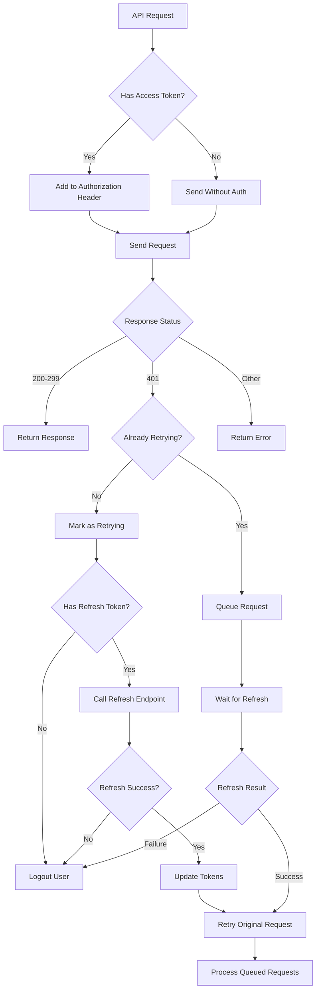

# API Client Refactor - Token-Based Authentication

## Overview

The global Axios instance (`lib/api.ts`) has been refactored to implement a robust token-based authentication flow that automatically handles:

- ✅ Access token attachment to all requests
- ✅ Automatic token refresh on 401 errors
- ✅ User logout when refresh token expires
- ✅ Prevention of infinite refresh loops
- ✅ Concurrent request queuing during token refresh

## Key Features

### 1. 🔐 Automatic Token Attachment

Every outgoing request automatically includes the access token in the Authorization header:

```typescript
Authorization: Bearer <access_token>
```

### 2. 🔄 Smart Token Refresh

When a request fails with 401 Unauthorized:
1. The interceptor checks if it's already retrying (prevents infinite loops)
2. Attempts to refresh the access token using the refresh token
3. On success: Updates tokens and retries the original request
4. On failure: Logs out the user and redirects to login

### 3. 🚫 Infinite Loop Prevention

- Requests are marked with `_retry` flag to prevent multiple refresh attempts
- Refresh endpoint failures don't trigger additional refresh attempts
- Multiple concurrent 401s are queued until the first refresh completes

### 4. 🎯 Concurrent Request Handling

When multiple requests fail simultaneously due to expired tokens:
- All requests are queued while the first one triggers token refresh
- After successful refresh, all queued requests are retried with the new token
- If refresh fails, all queued requests are rejected

## Token Storage

| Token Type | Storage Key | Purpose |
|------------|-------------|---------|
| Access Token | `access_token` | Short-lived token for API authentication |
| Refresh Token | `refresh_token` | Long-lived token for refreshing access tokens |

## API Functions

### Token Management

```typescript
// Get tokens
const accessToken = getAccessToken()
const refreshToken = getRefreshToken()

// Set tokens (usually done in login)
setAccessToken('your-access-token')
setRefreshToken('your-refresh-token')

// Clear all tokens
clearTokens()

// Logout user (clears tokens + redirects)
logoutUser(true) // showToast = true
```

### Authentication Check

```typescript
import { isUserAuthenticated } from './api-test-examples'

if (isUserAuthenticated()) {
  // User has valid tokens
  // Access token will be refreshed automatically if needed
}
```

## Usage Examples

### Basic API Calls

```typescript
import { api } from '@/lib/api'

// These automatically include authentication headers
const user = await api.get('/api/auth/me')
const lessons = await api.get('/api/lessons')
const newLesson = await api.post('/api/lessons', lessonData)
```

### With Error Handling

```typescript
import { api, logoutUser } from '@/lib/api'
import { handleApiError } from '@/lib/api-test-examples'

try {
  const response = await api.get('/api/lessons')
  setLessons(response.data)
} catch (error) {
  handleApiError(error)
  // 401 errors are handled automatically by interceptor
}
```

### Component Integration

```typescript
import { api, isUserAuthenticated, logoutUser } from '@/lib/api'

const MyComponent = () => {
  useEffect(() => {
    if (!isUserAuthenticated()) {
      // Redirect to login if no tokens
      window.location.href = '/login'
      return
    }
    
    // Make authenticated requests
    fetchData()
  }, [])

  const handleLogout = () => {
    logoutUser(true) // Clears tokens and redirects
  }

  return (
    // Your component JSX
  )
}
```

## Authentication Flow

### 1. Login Process

```typescript
// In your login function
const response = await api.post('/api/auth/login', credentials)
const { access_token, refresh_token } = response.data

setAccessToken(access_token)
setRefreshToken(refresh_token)

// Now all subsequent requests will be authenticated
```

### 2. Automatic Token Refresh



### 3. Error Scenarios

| Scenario | Behavior |
|----------|----------|
| Access token expired | → Automatically refresh and retry |
| Refresh token expired | → Logout user and redirect to login |
| Network error | → Return error (no refresh attempt) |
| Other 4xx/5xx errors | → Return error (no refresh attempt) |

## Backend Integration

The client expects these endpoints:

### Refresh Token Endpoint
```
POST /api/auth/refresh
Content-Type: application/json

{
  "refresh_token": "your-refresh-token"
}

Response:
{
  "access_token": "new-access-token",
  "refresh_token": "new-refresh-token" // optional
}
```

### Protected Endpoints
```
GET /api/auth/me
Authorization: Bearer <access-token>

Response: User data or 401 if token invalid
```

## Configuration

### Environment Variables

```env
VITE_API_URL=http://localhost:8000  # Backend URL
```

### Timeout Settings

```typescript
// In api.ts
timeout: 10000  // 10 second timeout
```

## Testing

Use the provided test functions in `api-test-examples.ts`:

```typescript
import {
  testExpiredAccessToken,
  testExpiredRefreshToken,
  testConcurrentRequests
} from '@/lib/api-test-examples'

// Test token refresh
await testExpiredAccessToken()

// Test logout on expired refresh token
await testExpiredRefreshToken()

// Test multiple concurrent requests
await testConcurrentRequests()
```

## Migration from Old Implementation

### Token Storage Changes

| Old | New | Migration |
|-----|-----|-----------|
| `auth_token` | `access_token` | Rename localStorage key |
| `getAuthToken()` | `getAccessToken()` | Use new function name |
| `setAuthToken()` | `setAccessToken()` | Use new function name |

### Backward Compatibility

Legacy functions are available for smooth migration:
```typescript
// These still work but are deprecated
const token = getAuthToken()  // → getAccessToken()
setAuthToken(token)           // → setAccessToken(token)
```

## Security Considerations

1. **Token Storage**: Tokens are stored in localStorage (consider httpOnly cookies for enhanced security)
2. **Automatic Logout**: Users are automatically logged out when refresh tokens expire
3. **Request Interception**: All API calls go through the same authentication flow
4. **No Token Exposure**: Tokens are not logged or exposed in console (except during development)

## Troubleshooting

### Common Issues

1. **Infinite redirects**: Check that login page doesn't trigger authentication
2. **Token not attached**: Verify token is stored with correct key (`access_token`)
3. **Refresh fails**: Check backend refresh endpoint and token format
4. **CORS issues**: Ensure backend allows Authorization header

### Debug Mode

Enable debug logging by checking browser console for:
- `Attempting to refresh access token...`
- `Access token refreshed successfully`
- `Token refresh failed:`
- `Refresh token is invalid or expired`

## Future Enhancements

- [ ] Move to httpOnly cookies for enhanced security
- [ ] Add token expiration checking before requests
- [ ] Implement automatic background token refresh
- [ ] Add retry logic for network failures
- [ ] Support for multiple concurrent auth contexts 